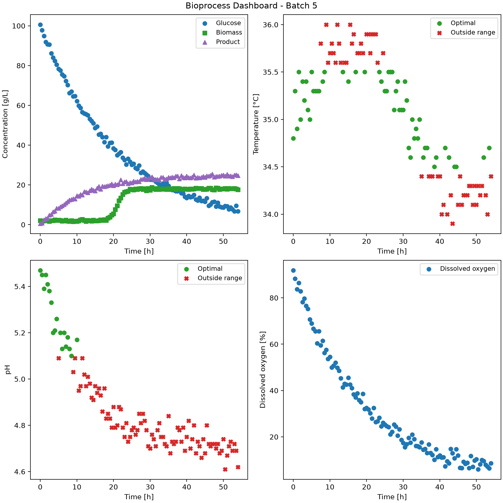

# Bioprocess Monitor For Optimal Conditions For Fermentation Process
## Description
Bioprocess monitoring tool that analyzes Fermentation  batch data and generates a visual dashboard/summary tables using Python code to analyze process performance data.

## Overview
The goals of this project is to be able to create a custom Python class that does the following:
1) Able to read, extract and organize fermentation data from CSV
2) Identify different batches within CSV, then separates and organize data into batch id
3) Analyzes data for each batch and determine if process operates under optimal pH and temperature ranges
4) Generates and formates figures to a Dashboard to show whether data for pH and temperature falls within optimal ranges, biomass concentrations, product being produced, glucose concentrations and dissolved oxygen are effected by the fermetnation process for each batch over time
5) Calculate and generate a table summerizing different statistics for each batch
6) Export dashboards and summary results as files

## Features
The python class (BioprocessMonitor) has the following features: 
* Reading CSV file using Pandas
* Select data for a specific batch
* Monitoring pH and temperature to determine if it is within optimal range
* Determining number of batches in data set
* Generate 2 by 2 dashboard and summary table showing all mention parameters
* Exports dashboard as an PNG and summary table as CSV
* Able do all features for multiple pH and temperature ranges or conditions (two in this case)

## Technologies Used
Python was used to code project, using PyCharm as the interface. There are two main libraries used for this code:
1) pandas (version 3.0.6) was used to import, clean, transform and filter though data stored in CSV
2) matplotlib (version 3.11.2) was used to make graphs and plots

## Code Design
When main.py is run, it creates a BioprocessMonitor class to organize the fermentation data set into different batches. The program first imports the CSV dataset using Pandas and stores the user-defined pH and temperature operating limits. The __init__ method is used to set up the class and import the dataset. The extract_batch() method is used to select an individual batch from the dataset and sort it according to fermentation time. The get_n_batches() method is used to find the number of different batches in the dataset.
The export_dashboard() method uses Matplotlib to generate a 2 by 2 dashboard containing plots for temperature, pH, dissolved oxygen, and the different concentrations. For pH and temperature, if/else statements are used to identify whether a point in the data falls within or outside the acceptable range. This decides whether the point is displayed as a green circle if it is within the operating range or a red X if it is outside the operating range.
The export_summary() method is then used to go through each batch and calculate the percentage of measurements that are within the acceptable pH and temperature ranges, as well as the final product concentration. The results are then saved as a summary CSV file, while the dashboard from export_dashboard() is saved as an image

## Dashboard

Figure shows data gathered from the 5th batch and were tested to be within parameters B (pH between 5.1 and 5.5, temperature between 34.5 and 35.5 °C).
* The top left corner shows the concentrations of glucose, biomass and product throughout time. As shown, as glucose is used, both biomass and subsequently product increase, with product growing slowly over time and reaching a plateau, while biomass suddenly increases at around the 20-hour mark.
* The top right graph shows the temperature fluctuation throughout time during the process. As shown, all points that are green data points represent when the process was within the optimal temperature range, while red Xs represent points outside the range. The data follows a periodic trend, with the system seeming to get out of the optimal range briefly between approximately 10–20 hours and again between approximately 30–60 hours.
* The bottom left graph shows the pH of the system over time. The pH follows a decreasing trend throughout the process, starting at approximately 5.5 and gradually decreasing to around 4.7 by the end of the batch. As shown, the pH remains within the optimal range at the beginning of the process, but begins to fall below the lower limit of 5.1 after approximately 8 hours.
* The bottom right graph shows the dissolved oxygen throughout the process. As shown, the dissolved oxygen follows a decreasing trend throughout the process, starting at approximately 90% and decreasing to below 10% by the end of the batch.

## Summary Table
|Batch id|pH Optimal Percent (%)       |Temperature Optimal (%)|C_product (9_L^-1)                           |
|--------|-----------------------------|-----------------------|---------------------------------------------|
|1       |36.08                        |51.55                  |46.5                                         |
|2       |34.71                        |55.37                  |50.8                                         |
|3       |36.99                        |46.58                  |44.6                                         |
|4       |54.12                        |62.35                  |48.6                                         |
|5       |16.51                        |49.54                  |24.7                                         |

Table shows how different batches managed to maintain optimal pH and temperature under parameters B (pH between 5.1 and 5.5, temperature between 34.5 and 35.5 °C) and comparing that to product produced. Most batches seem to remain in optimal pH at ~35% and optimal temperature range ~50% of the time. There are two notable exceptions being batch 4 at 54.12% of the time in optimal pH conditions and 62.35% in optimal temperature conditions, and batch 5 at 16.51% of the time in optimal pH conditions. Similarly most batches seem to produce between 44–51 g/L of product, with batch 5 being again, an exception with only producing a final amount of 24.7 g/L. This could be due to suboptimal pH conditions the cells were exposed to, though further research and investigation would be needed to validate this if it was a real world example.
